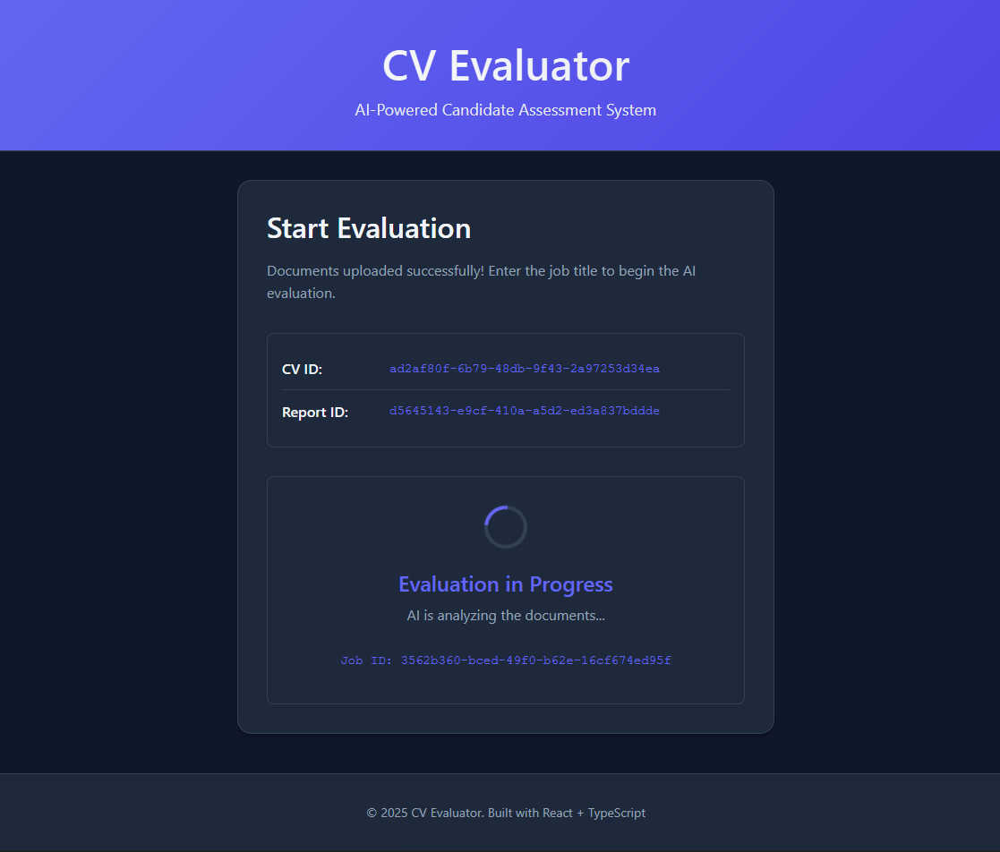

# CV Evaluator Frontend

A modern React + TypeScript frontend for the CV Evaluator project - an AI-powered candidate assessment system.

## 📸 Screenshots

<div align="center">

### 🔄 Loading Screen
*Waiting for AI evaluation results*



---

### 📊 Evaluation Results - Overview
*Comprehensive candidate assessment with overall scores and recommendations*


</div>

---

## Features

- 📄 **File Upload**: Upload candidate CV and project report (PDF files)
- 🔄 **Real-time Evaluation**: Trigger AI evaluation and track progress with polling
- 📊 **Detailed Results**: Comprehensive display of evaluation results including:
  - Overall assessment and recommendation
  - CV analysis with match rate
  - Project report evaluation
  - Detailed breakdowns for all scoring parameters
- 🎨 **Modern UI**: Beautiful, responsive design with great UX
- ⚡ **Fast & Efficient**: Built with Vite for optimal performance

## Tech Stack

- **React 18** - UI library
- **TypeScript** - Type safety
- **Vite** - Build tool and dev server
- **Axios** - HTTP client
- **CSS3** - Modern styling with CSS variables

## Prerequisites

- Node.js 18+ and npm
- Backend API running (default: http://localhost:8000)

## Installation

1. Clone the repository:
```bash
git clone <repository-url>
cd CV-Evaluator-FE
```

2. Install dependencies:
```bash
npm install
```

3. Create environment file:
```bash
cp .env.example .env
```

4. Configure the backend API URL in `.env`:
```env
VITE_API_BASE_URL=http://localhost:8000
```

## Development

Start the development server:

```bash
npm run dev
```

The application will be available at `http://localhost:3000`

## Building for Production

Build the application:

```bash
npm run build
```

Preview the production build:

```bash
npm run preview
```

## Project Structure

```
src/
├── components/
│   ├── FileUpload.tsx         # File upload component
│   ├── EvaluationForm.tsx     # Evaluation trigger form
│   ├── ResultsDisplay.tsx     # Results display component
│   ├── FileUpload.css
│   ├── EvaluationForm.css
│   └── ResultsDisplay.css
├── api.ts                     # API service layer
├── types.ts                   # TypeScript type definitions
├── App.tsx                    # Main application component
├── App.css
├── main.tsx                   # Application entry point
└── index.css                  # Global styles
```

## API Integration

The frontend communicates with the backend through three main endpoints:

### POST /upload
Upload CV and project report files:
```typescript
{
  cv: File,
  project: File
}
```

### POST /evaluate
Trigger evaluation:
```typescript
{
  job_title: string,
  cv_id: string,
  report_id: string
}
```

### GET /result/{id}
Poll for evaluation results (automatically polls every 2 seconds while processing)

## User Flow

1. **Upload Documents**: User uploads CV and project report (PDF files)
2. **Start Evaluation**: User enters job title and triggers evaluation
3. **Wait for Results**: System polls backend for status updates
4. **View Results**: Comprehensive results displayed with detailed breakdowns

## Design Decisions

- **Single Page Application**: Smooth user experience without page reloads
- **Status Polling**: Automatic polling every 2 seconds for evaluation status
- **Progressive Disclosure**: Information revealed step-by-step to avoid overwhelming users
- **Responsive Design**: Works well on desktop, tablet, and mobile devices
- **Error Handling**: Clear error messages and validation
- **Dark Theme**: Modern dark theme that's easy on the eyes

## Browser Support

- Chrome/Edge (latest)
- Firefox (latest)
- Safari (latest)

## License

MIT License - see LICENSE file for details

## Contributing

Contributions are welcome! Please feel free to submit a Pull Request.

